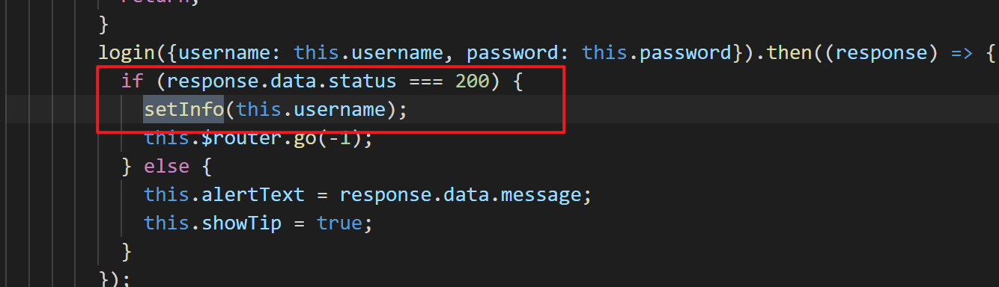
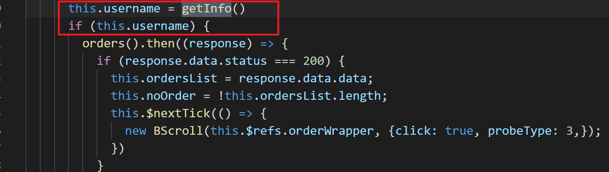
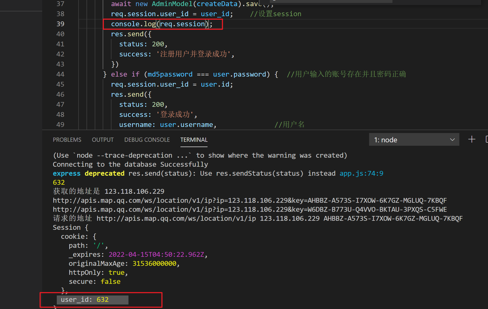
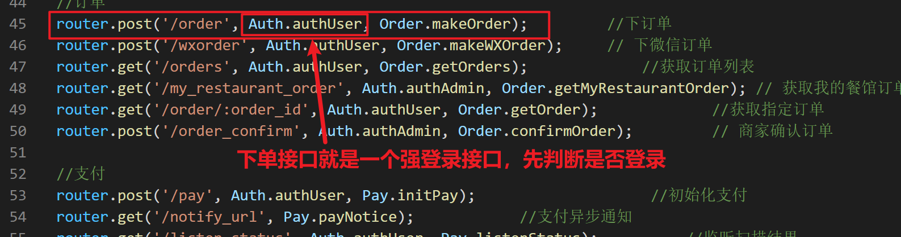
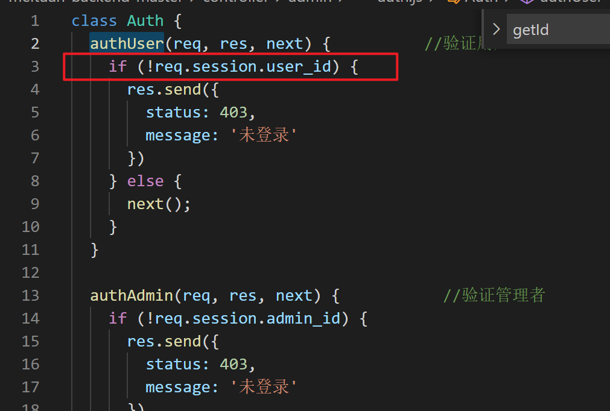
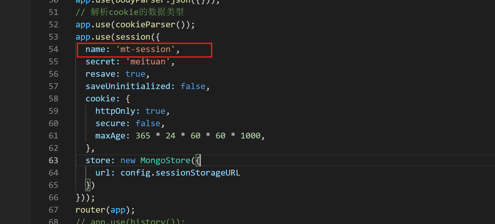

# 登录

## 前端

**cookie存储**：在调用登录接口登录成功之后，在cookie中存储了一个用户名，在退出登录的时候清除这个cookie，但是美团项目中没有做退出登录的处理

**目的：**前端也存储一个登录之后的用户名称的目的是，在调用需要用户登录的接口之前，直接存储在cookie中的用户名做判断就可以了，不需要向后端发起请求，前端直接判断，减少向服务器发请求的次数

## 后端

**1. session存储**: 只要访问一个网站，服务器就会自动生成一个sessionId，这个seeionId是一个唯一的字符串，具体sessionId包含的信息和访问服务器的客户端的一些信息相关，在登录的时候美团项目的后端把user_id存储在session中了，判断登录的时候也就是判断这个session中是否存储了user_id

**2.判断用户是否登录**：前端携带cookie访问后端，后端服务器会自动根据cookie中的seeionId，找到具体的sssion对象，通过判断session对象中是否有user_Id,来判断是否登录了，每个需要登录的接口，在请求之前都会调用判断是否登录的接口，而这些需要判断登录的接口就称为强登录接口

**3. cookie**: 服务器会自动将sessionId写入前端cookie中，cookie中存了sessionId，cookie中存储sessionId的名称可以自己配置，图中圈出的是配置cookie中存储的key的名称

